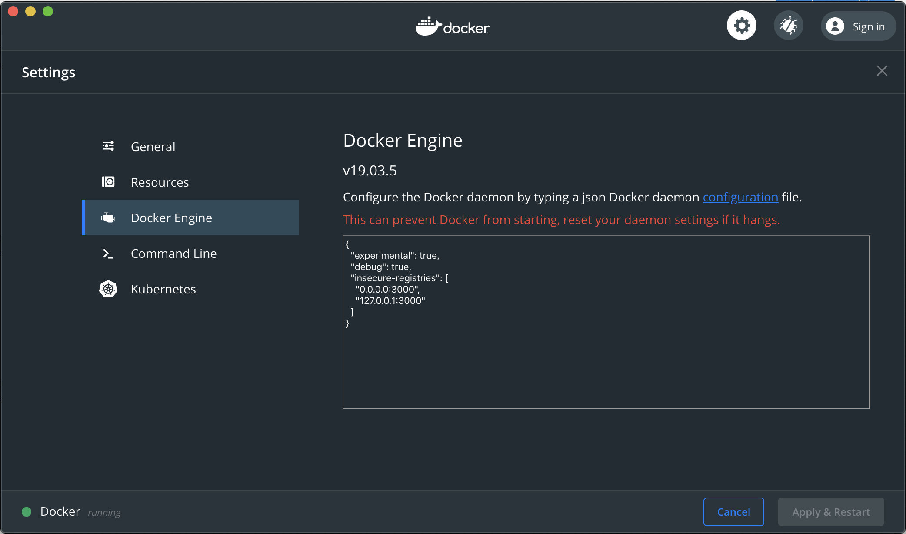

# Dependency Proxy

This document describes how to enable the [dependency proxy](https://docs.gitlab.com/ee/user/packages/dependency_proxy/)
in your GDK environment.

## Enable Puma

Puma is enabled by default, however, if you are using Unicorn, you need to
[switch back to Puma](unicorn.md).

## License

An [`Ultimate` license](https://about.gitlab.com/handbook/developer-onboarding/#working-on-gitlab-ee)
is needed to use the dependency proxy.

## Configuration

### Linux

With the License and Puma requirements met above, there is no additional set up required,
the dependency proxy is already enabled and configured.

Test it with

```sh
sudo docker run localhost:3000/gitlab-org/dependency_proxy/containers/hello-world:latest
```

Docker should succeed and you should see

```sh
Hello from Docker!
This message shows that your installation appears to be working correctly.
```

in the output.

### MacOS

#### Use an IP address with your GDK installation, `localhost` will not work

This can be accomplished by [updating the GDK configuration](configuration.md) by
creating or updating the `gdk.yml` file in the root of your GDK directory.

The file should contain the intended host, such as `127.0.0.1` or `0.0.0.0`:

```ini
host: 0.0.0.0
```

Run `gdk reconfigure` and `gdk restart` to invoke the changes and visit the IP
(`0.0.0.0:3000`) to check if GitLab is accessible through the new IP.

#### Add this IP address and port to the list of insecure registries and restart Docker

##### Old Docker for Mac (< 2.2.0.0)

Open Docker -> Preferences, and navigate to the tab labelled **Daemon**.
Check the box to enable **Experimental features** and you will be able to add
a new **Insecure registry**. Click **Apply & Restart**.


##### Docker for Mac 2.2.0.0+ (newest versions)

Open Docker -> Right click on status bar -> Preferences -> Docker Engine, and type in:

```json
{
  "experimental": true,
  "insecure-registries": ["0.0.0.0:3000", "127.0.0.1:3000"]
}
```



Once Docker has restarted, you can test the dependency proxy with:

```sh
sudo docker run 0.0.0.0:3000/gitlab-org/dependency_proxy/containers/hello-world:latest
```

Docker should succeed and you should see the following:

```sh
Hello from Docker!
This message shows that your installation appears to be working correctly.
```
