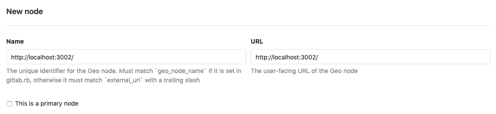

# GitLab Geo

This document will instruct you to set up GitLab Geo using GDK.

## Prerequisites

Development on GitLab Geo requires two Enterprise Edition GDK
instances running side-by-side. You can use an existing `gdk-ee`
instance based on the [Set up GDK](../set-up-gdk.md#gitlab-enterprise-edition) documentation as primary node.

### Secondary

Now we'll create a secondary instance in a `gdk-geo` folder to act as
a secondary node. We'll configure unique ports for the new instance so
that it can run alongside the primary.

```bash
gdk init gdk-geo
cd gdk-geo
echo 3002 > port
echo 3807 > webpack_port
# Assuming your primary GDK instance lives in parallel folders:
gdk install gitlab_repo=../gdk-ee/gitlab
# Cancel (Ctrl-C) seeding when it starts since we will delete the data anyway
gdk run db

# In another terminal window
make geo-setup
```

## Database replication

For GitLab Geo, you will need a primary/secondary database replication defined.
There are a few extra steps to follow.

### Prepare primary for replication

In your primary instance (`gdk-ee`) you need to prepare the database for
replication. This requires the PostgreSQL server to be running, so we'll start
the server, perform the change (via a `make` task), and then kill and restart
the server to pick up the change:

```bash
cd gdk-ee

# terminal window 1:
foreman start postgresql

# terminal window 2:
make postgresql-replication-primary

# terminal window 1:
# stop foreman by hitting Ctrl-C, then restart it:
foreman start postgresql

# terminal window 2:
make postgresql-replication-primary-create-slot

# terminal window 1:
# stop foreman by hitting Ctrl-C, then restart it:
foreman start postgresql
```

### Set up replication on secondary

Because we'll be replicating the primary database to the secondary, we need to
remove the secondary's PostgreSQL data folder:

```bash
# terminal window 2:
cd gdk-geo
rm -r postgresql
```

Now we need to add a symbolic link to the primary instance's data folder:

```bash
# From the gdk-geo folder:
ln -s ../gdk-ee/postgresql postgresql-primary
```

Initialize a secondary database and setup replication:

```bash
# terminal window 2:
make postgresql-replication-secondary
```

Now you can go back to **terminal window 1** and stop `foreman` by hitting
<kbd>Ctrl-C</kbd>.

### Running tests

The secondary has a read-write tracking database, which is necessary for some
Geo tests to run. However, its copy of the replicated database is read-only, so
tests will fail to run.

You can add the tracking database to the primary node by running:

```bash
# From the gdk-ee folder:
gdk run db

# In another terminal window
make geo-setup
```

This will add both development and test instances, but the primary will continue
to operate *as* a primary except in tests where the current Geo node has been
stubbed.

To ensure the tracking database is started, restart GDK. You will need to use
`gdk run db geo_db` (at a minimum) or `gdk run` to be able to run the tests.

## Copy database encryption key

The primary and the secondary nodes will be using the same secret key
to encrypt attributes in the database. To copy the secret from your primary to your secondary:

1. Open `gdk-ee/gitlab/config/secrets.yml` with your editor of choice
1. Copy the value of `development.db_key_base`
1. Paste it into `gdk-geo/gitlab/config/secrets.yml`

## SSH cloning

To be able to clone over SSH on a secondary, follow the instruction on how
to set up [SSH](ssh.md), including [SSH key lookup from database](ssh.md#ssh-key-lookup-from-database).

## Configure Geo nodes

### Add primary node

There is a rake task that can add the primary node:

```bash
cd gdk-ee/gitlab

bundle exec rake geo:set_primary_node
```

### Add secondary node

There isn't a convenient rake task to add the secondary node because the command
must be run on the secondary, but written on the primary. So we must get the
name and manually add the node. Open a terminal window on the secondary node.
This will output the secondary node's name.

```bash
cd gdk-geo/gitlab

bundle exec rails runner 'puts GeoNode.current_node_name'
```

1. Visit the **primary** node's **Admin Area ➔ Geo Nodes** (`/admin/geo/nodes`)
   in your browser.
1. Click the **New node** button.
1. Using the *exact* output from the `puts GeoNode.current_node_name` command,
   fill in the **Name** and **URL** fields for the **secondary** node.
1. **Do not** check the box 'This is a primary node'.
1. Click the **Add node** button.



## Useful aliases

Customize to your liking. Requires `gdk run` to be running.

```bash
alias geo_primary_migrate="bundle install && bin/rake db:migrate db:test:prepare geo:db:migrate geo:db:test:prepare"
alias geo_primary_update="gdk update && geo_primary_migrate && cd .. && make postgresql/geo-fdw/test/rebuild && cd gitlab && gco -- db/schema.rb ee/db/geo/schema.rb"
alias geo_secondary_migrate="bundle install && bin/rake geo:db:migrate"
alias geo_secondary_update="gdk update; geo_secondary_migrate && cd .. && make postgresql/geo-fdw/development/rebuild && cd gitlab && gco -- db/schema.rb ee/db/geo/schema.rb"
```

### `geo_primary_migrate`

Use this when your checked out files have changed, and e.g. your instance or
tests are now erroring. For example, after you pull master, but you don't care
to update dependencies right now. Or maybe you checked out someone else's
branch.

* Bundle installs to ensure gems are up-to-date
* Migrates main DB and tracking DB (be sure to run `geo_secondary_migrate` on
your secondary if you have Geo migrations)
* Prepares main and tracking test DBs

### `geo_primary_update`

Same as `geo_primary_migrate`, but also:

* Does `gdk update`
* Checks out and pulls master
* Updates dependencies (e.g. if Gitaly is erroring)
* Rebuilds FDW tables in test DB
* Checks out schemas to get rid of irrelevant diffs (not done in
   `geo_primary_migrate` because you may have created a migration)

### `geo_secondary_migrate`

Similar to `geo_primary_migrate` but for your local secondary.

### `geo_secondary_update`

Similar to `geo_primary_update` but for your local secondary.

## Troubleshooting

### postgresql-geo/data exists but is not empty

If you see this error during setup because you have already run `make geo-setup` once:

```
initdb: directory "postgresql-geo/data" exists but is not empty
If you want to create a new database system, either remove or empty
the directory "postgresql-geo/data" or run initdb
with an argument other than "postgresql-geo/data".
make: *** [postgresql/geo] Error 1
```

Then you may delete or move that data in order to run `make geo-setup` again.

```bash
$ mv postgresql-geo/data postgresql-geo/data.backup
```

### GDK update command error on secondaries

You will see the following error after running `gdk update` on your local Geo
secondary. It is ok to ignore. Your local Geo secondary does not have or need a
test DB, and this error occurs on the very last step of `gdk update`.

```bash
cd /Users/foo/Developer/gdk-geo/gitlab && \
      bundle exec rake db:migrate db:test:prepare
rake aborted!
ActiveRecord::StatementInvalid: PG::ReadOnlySqlTransaction: ERROR:  cannot execute DROP DATABASE in a read-only transaction
: DROP DATABASE IF EXISTS "gitlabhq_test"
/Users/foo/.rbenv/versions/2.6.3/bin/bundle:23:in `load'
/Users/foo/.rbenv/versions/2.6.3/bin/bundle:23:in `<main>'

Caused by:
PG::ReadOnlySqlTransaction: ERROR:  cannot execute DROP DATABASE in a read-only transaction
/Users/foo/.rbenv/versions/2.6.3/bin/bundle:23:in `load'
/Users/foo/.rbenv/versions/2.6.3/bin/bundle:23:in `<main>'
Tasks: TOP => db:test:load => db:test:purge
(See full trace by running task with --trace)
make: *** [gitlab-update] Error 1
```

### FDW is no longer working even though you have it enabled, after migrations or `gdk update`

You need to rebuild FDW tables.

If your local primary is in `~/Developer/gdk-ee`:

```bash
cd ~/Developer/gdk-ee
gdk run # In another tab, if it's not already running
make postgresql/geo-fdw/test/rebuild
```

And if your local secondary is in `~/Developer/gdk-geo`:

```bash
cd ~/Developer/gdk-geo
gdk run # In another tab, if it's not already running
make postgresql/geo-fdw/development/rebuild
```

Also see [Useful aliases](#useful-aliases) above.
