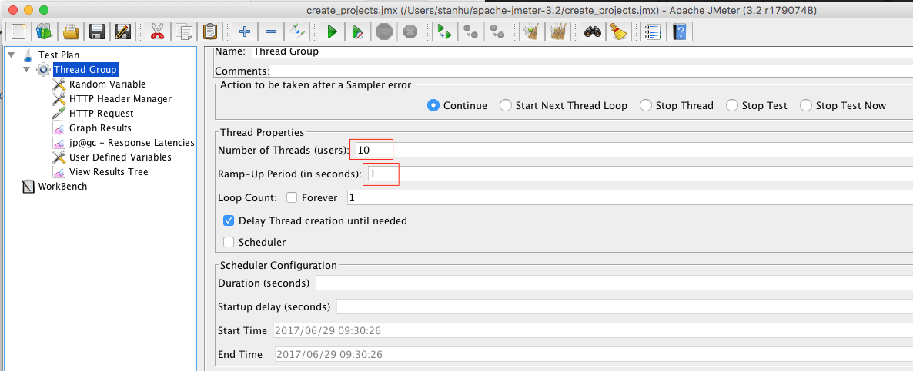
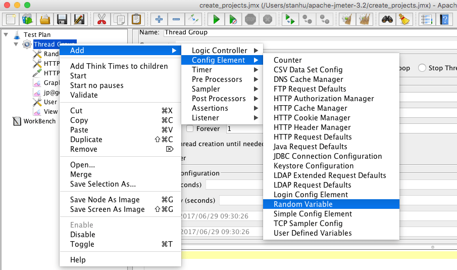
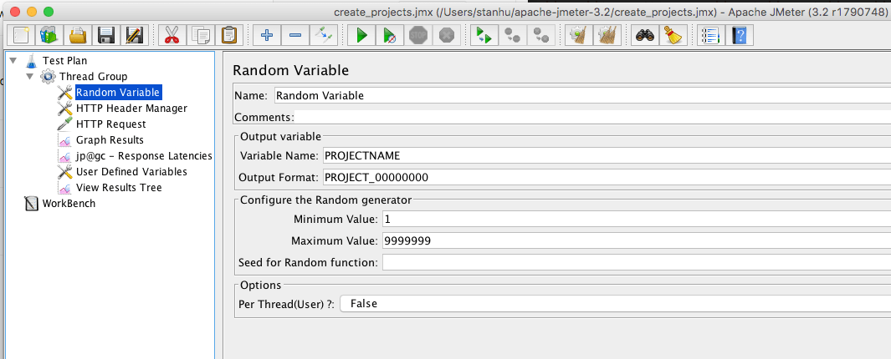
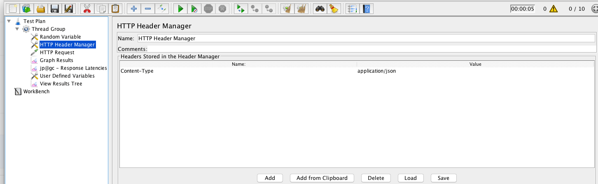
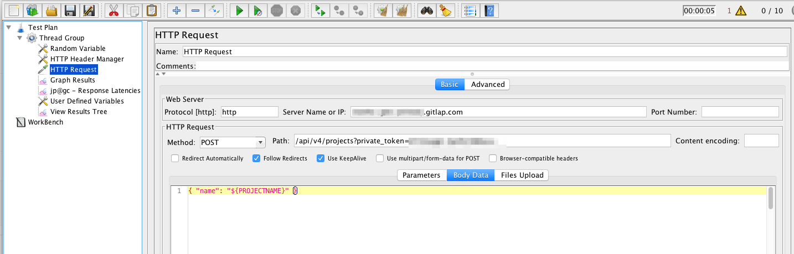

# Load Testing

## Large Staging Collider

Load testing is done by simply running siege
on a bunch of URLs at a regular interval. Monitoring of the results in turn is
done using Prometheus.

See the [Large Staging Collider repository](https://gitlab.com/gitlab-com/large-staging-collider/) for additional
instructions.

## GitLab Load Kit

GitLab Load Kit uses k6 to generate load.
The author reports:
> `gitlab-load-kit` is able to quick induce enough load from my laptop to start causing issues in staging

See the [GitLab Load Kit repository](https://gitlab.com/andrewn/gitlab-load-kit/) for additional instructions.

## JMeter

Some customers use JMeter to load test GitLab. Here are instructions to set this up:

1. Create a Thread Group. Here is where you set the number of users and the ramp-up period.

    

2. Add a Random Variable element by right-clicking on Thread Group:

    

    

3. Add an HTTP Header element (right-click on Thread Group -> Add -> HTTP Header Manager):

    

4. Add an HTTP request element. Fill in https if you are using HTTPS. Add the
hostname to Server Name field. Select POST as the request type, and
api/v4/projects?private_token=XXX. Add { "name": "${PROJECTNAME}" } as the
Body Data:

    

5. Add a Graph Results and View Results element to see output.

6. Click "Run" to run the test.
