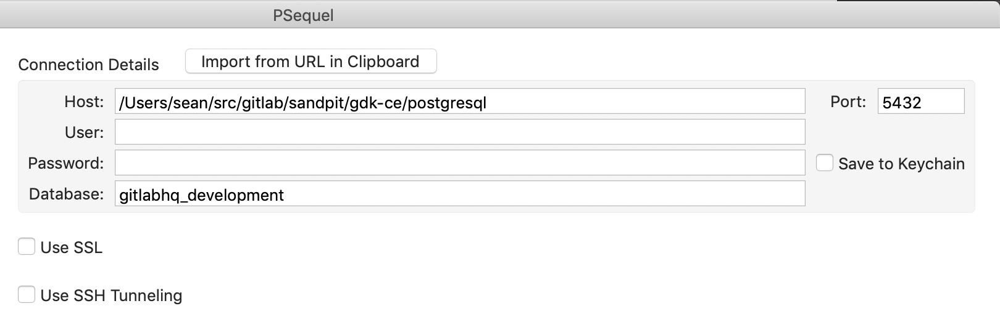

## Accessing PostgreSQL

GDK uses the Postgres binaries installed on your system
(see [install](../prepare.md) section), but keeps the PostgreSQL
datafiles within the GDK directory structure, under `<path to GDK>/gitlab-development-kit/postgresql/data`.
This means that the databases cannot be seen with `psql -l`.

To access the development database using `psql`, use the Rails `dbconsole` command from your GDK root:

```bash
bundle exec rails dbconsole
```

Use `$RAILS_ENV` to access the test environment:

```bash
RAILS_ENV=test bundle exec rails dbconsole
```

To access the database using an external SQL editor, pass in the:

- Datafile path - e.g. `<path to GDK>/gitlab-development-kit/postgresql`
- Database port - e.g. `5432`
- Database name - e.g. `gitlabhq_development` or `gitlabhq_test`



