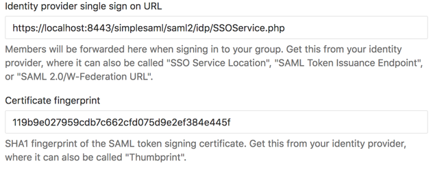

# SAML

You can run a test SAML identity provider using the [jamedjo/test-saml-idp](https://hub.docker.com/r/jamedjo/test-saml-idp/)
docker image, both to test instance-wide SAML and the multi-tenant Group SAML used on GitLab.com

## Group SAML

This requires [HTTPS](https.md) to be set up locally and the identity provider to be configured using your group's callback URL and entity ID.

For example, an identity provider for the "zebra" group can be ran using the following:

```shell
docker run --name=gitlab_saml_idp -p 8080:8080 -p 8443:8443 \
-e SIMPLESAMLPHP_SP_ENTITY_ID=https://localhost:3443/groups/zebra \
-e SIMPLESAMLPHP_SP_ASSERTION_CONSUMER_SERVICE=https://localhost:3443/groups/zebra/-/saml/callback \
-d jamedjo/test-saml-idp
```

From GitLab this would then be [configured](https://docs.gitlab.com/ee/user/group/saml_sso/#how-to-configure) using:

- **SSO URL:** https://localhost:8443/simplesaml/saml2/idp/SSOService.php
- **Certificate fingerprint:** 119b9e027959cdb7c662cfd075d9e2ef384e445f



You'll also need to enable Group SAML in [gitlab/config/gitlab.yml](https://gitlab.com/gitlab-org/gitlab-ee/blob/d8ef45c25ef3f08e5fcda703185f36203bfecd6b/config/gitlab.yml.example#L693):

```yaml
omniauth:
    providers:
      - { name: 'group_saml' }
```

## Credentials

The following users are described in the [docker image documenation](https://hub.docker.com/r/jamedjo/test-saml-idp/#usage):

| Username | Password |
| -------- | -------- |
| user1 | user1pass |
| user2 | user2pass |
