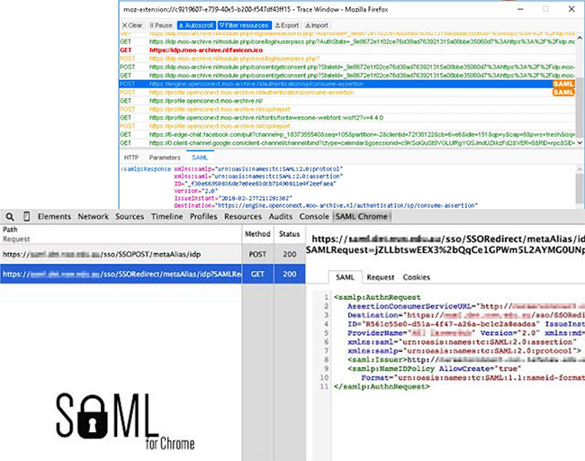

# SAML

You can run a test SAML identity provider using the [jamedjo/test-saml-idp](https://hub.docker.com/r/jamedjo/test-saml-idp/)
docker image, both to test instance-wide SAML and the multi-tenant Group SAML used on GitLab.com.

## Group SAML

### GitLab configuration

Group SAML requires [HTTPS](https.md) to be set up for GitLab and you'll also need to enable Group SAML in [`gitlab/config/gitlab.yml`](https://gitlab.com/gitlab-org/gitlab/blob/d8ef45c25ef3f08e5fcda703185f36203bfecd6b/config/gitlab.yml.example#L693):

```yaml
omniauth:
    providers:
      - { name: 'group_saml' }
```

### Docker

The docker identity provider needs to be configured using your group's callback URL and entity ID.
For example, an identity provider for the "zebra" group can be ran using the following:

```shell
docker run --name=gitlab_saml_idp -p 8080:8080 -p 8443:8443 \
-e SIMPLESAMLPHP_SP_ENTITY_ID=https://localhost:3443/groups/zebra \
-e SIMPLESAMLPHP_SP_ASSERTION_CONSUMER_SERVICE=https://localhost:3443/groups/zebra/-/saml/callback \
-d jamedjo/test-saml-idp
```

### Configuring the group

From GitLab this would then be [configured](https://docs.gitlab.com/ee/user/group/saml_sso/#how-to-configure) using:

- **SSO URL:** https://localhost:8443/simplesaml/saml2/idp/SSOService.php
- **Certificate fingerprint:** 119b9e027959cdb7c662cfd075d9e2ef384e445f


### Signing in

Unlike instance-wide SAML, this doesn't add a button to GitLab's global `/users/sign_in` page.
Instead you can use `https://localhost:3443/groups/zebra/-/saml/sso` as displayed on the group configuration page.

Sign in can also be initiated from the identity provider at `https://localhost:8443/simplesaml/saml2/idp/SSOService.php?spentityid=https%3A%2F%2Flocalhost%3A3443%2Fgroups%2Fzebra`

## Instance SAML with Docker

Configuring SAML for a GitLab instance can be done using the [SAML OmniAuth Docs](https://docs.gitlab.com/ee/integration/saml.html).

To start an identity provider that works with instance SAML, you'll need to configure the entity ID and callback URL when starting the container:

```shell
docker run --name=instance_saml_idp -p 8080:8080 -p 8443:8443\
-e SIMPLESAMLPHP_SP_ENTITY_ID=http://<gitlab-host>:<gitlab-port> \
-e SIMPLESAMLPHP_SP_ASSERTION_CONSUMER_SERVICE=http://<gitlab-host>:<gitlab-port>/users/auth/saml/callback \
-d jamedjo/test-saml-idp
```

In addition, you'll need to configure the `idp_sso_target_url`, `issuer`, and `idp_cert_fingerprint` to match the values provided by the Docker image:

```yaml
omniauth:
  providers:
  - {
      name: 'saml',
      args: {
        assertion_consumer_service_url: 'http://localhost:3000/users/auth/saml/callback',
        idp_cert_fingerprint: '11:9b:9e:02:79:59:cd:b7:c6:62:cf:d0:75:d9:e2:ef:38:4e:44:5f',
        idp_sso_target_url: 'https://localhost:8443/simplesaml/saml2/idp/SSOService.php',
        issuer: 'http://localhost:3000',
        name_identifier_format: 'urn:oasis:names:tc:SAML:2.0:nameid-format:persistent'
      }
    }
```

## Credentials

The following users are described in the [docker image documentation](https://hub.docker.com/r/jamedjo/test-saml-idp/#usage):

| Username | Password |
| -------- | -------- |
| user1 | user1pass |
| user2 | user2pass |

## Video tutorial

We made a video demoing SAML setup and debugging, describing key SAML concepts,
and giving a run through of our SAML codebase. This can be found at
https://www.youtube.com/embed/CW0SujsABrs with [slides also available](https://gitlab.com/gl-retrospectives/manage/uploads/2c057dd7fddb91512e93d006a3fc0048/SAML_Knowledge_Sharing__Manage_201s_.pdf).

## Debugging tools

Because SAML is a browser based protocol with base64 encoded messages it can be
useful to use a tool that decodes these messages on the fly. Tools such as:

- [SAML tracer for Firefox](https://addons.mozilla.org/en-US/firefox/addon/saml-tracer/)
- [Chrome SAML Panel](https://chrome.google.com/webstore/detail/saml-chrome-panel/paijfdbeoenhembfhkhllainmocckace?hl=en)


